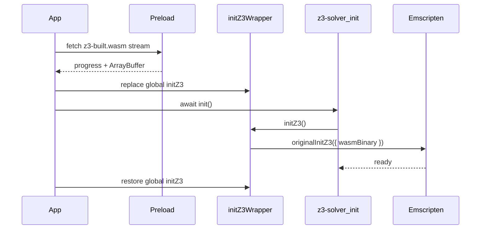

# Z3 WASM loading bar and blocking modal

## Current behavior

- [`index.html`](c:\Users\scypr\OneDrive\Documents\Coding\hoare-logic-proof-checker\index.html) loads [`public/z3-built.js`](c:\Users\scypr\OneDrive\Documents\Coding\hoare-logic-proof-checker\public\z3-built.js) globally so `initZ3` exists in the browser.
- The React app uses [`src/utilities/handle-check-proof-validity/z3-logic/initialise-z3-funcs.ts`](c:\Users\scypr\OneDrive\Documents\Coding\hoare-logic-proof-checker\src\utilities\handle-check-proof-validity\z3-logic\initialise-z3-funcs.ts), which calls `init()` from `z3-solver` only when the user runs a proof check (lazy). WASM is then fetched inside Emscripten via `fetch` + `arrayBuffer()` (no progress hooks).
- [`public/z3-built.wasm`](c:\Users\scypr\OneDrive\Documents\Coding\hoare-logic-proof-checker\public\z3-built.wasm) is the static asset to track.

## Feasibility of a real progress bar

- **Yes, with one integration trick:** Emscripten’s modular factory honors a preloaded `wasmBinary` on the module argument (see `getBinaryPromise` / `wasmBinary` handling in [`public/z3-built.js`](c:\Users\scypr\OneDrive\Documents\Coding\hoare-logic-proof-checker\public\z3-built.js)). The published [`z3-solver` browser `init()`](https://unpkg.com/z3-solver@4.14.1/build/browser.js) calls `initZ3()` with **no** args, but you can temporarily wrap `globalThis.initZ3` so every call becomes `originalInitZ3({ ...userArgs, wasmBinary })` after you have loaded the bytes yourself.
- **Determinate percentage** requires a total size: use `fetch` + `ReadableStream` and `Content-Length`. If the header is missing (some proxies, chunked encoding), fall back to an **indeterminate** bar (animated) or 0–100 with “unknown size” copy—still satisfies “loading bar” without lying about percent.
- **After download:** Emscripten still does instantiate/compile work; optionally show a short second phase label (e.g. “Starting solver…”) after bytes reach 100%.

## Architecture

## Implementation steps

1. **`preload-z3-wasm.ts` (new, under `src/utilities/…` or `src/lib/`)**  
   - `fetch('/z3-built.wasm', { credentials: 'same-origin' })`.  
   - If `response.body` and `content-length`: read chunks, update `loaded/total` for UI.  
   - Else: indeterminate mode; still return full `ArrayBuffer` at the end.  
   - Return `{ arrayBuffer, mode: 'determinate' | 'indeterminate' }` (or similar).

2. **Singleton `ensureZ3Ready(onProgress?)` (extend or sit next to [`initialise-z3-funcs.ts`](c:\Users\scypr\OneDrive\Documents\Coding\hoare-logic-proof-checker\src\utilities\handle-check-proof-validity\z3-logic\initialise-z3-funcs.ts))**  
   - **Browser** (`typeof globalThis.initZ3 === 'function'`): run preload → `const orig = globalThis.initZ3; globalThis.initZ3 = (opts = {}) => orig({ ...opts, wasmBinary: new Uint8Array(ab) });` → `await init()` from `z3-solver` → restore `globalThis.initZ3`.  
   - **Node / Jest** ([`jest.config.js`](c:\Users\scypr\OneDrive\Documents\Coding\hoare-logic-proof-checker\jest.config.js) uses `testEnvironment: "node"`): skip preload and wrapper; `await init()` only (current behavior).  
   - Cache a single `Promise` so React StrictMode double-mount and concurrent callers do not double-initialize.  
   - Replace the direct `await init()` inside `getZ3Context()` with `await ensureZ3Ready()` so proof checking and app startup share one initialization.

3. **Eager startup from the UI**  
   - In [`App.tsx`](c:\Users\scypr\OneDrive\Documents\Coding\hoare-logic-proof-checker\App.tsx), `useEffect` calls `ensureZ3Ready(onProgress)` on mount (browser only) to drive the overlay and avoid waiting until first “Check Proof Validity”.

4. **Blocking modal + progress bar**  
   - Add a small presentational component (e.g. `z3-ready-overlay.tsx`) using `@radix-ui/react-dialog` (already a dependency via [`sheet.tsx`](c:\Users\scypr\OneDrive\Documents\Coding\hoare-logic-proof-checker\src\components\base\sheet.tsx)): `open={!ready}`, `modal`, no close control, high `z-index`, overlay blocks pointer events to the whole shell.  
   - Copy: state that the **proof validator** is not ready until loading finishes (matches your wording).  
   - Progress: Tailwind-styled `
` bar; determinate width from `loaded/total`, indeterminate CSS animation when total unknown.  
   - Optional: `onError` state with retry calling `ensureZ3Ready` again (reset cached promise only on explicit retry).

5. **Typing**  
   - Extend [`src/vite-env.d.ts`](c:\Users\scypr\OneDrive\Documents\Coding\hoare-logic-proof-checker\src\vite-env.d.ts) (or a small `global.d.ts`) with `initZ3` on `globalThis` for TypeScript.

## Scope notes

- **Fullscreen block** is the straightforward reading of “disable interactions” and a persistent modal; the sidebar and other pages stay non-interactive until Z3 is ready. If you later want Reference/Settings usable without Z3, narrow the overlay to [`PageContent`](c:\Users\scypr\OneDrive\Documents\Coding\hoare-logic-proof-checker\src\components\page-content\page-content.tsx) or validator-only controls.
- **Pthread workers** may still load assets from cache after the main binary is injected; the bar reflects the primary WASM download users care about.

## Testing / verification

- Manual: run `npm run dev`, throttle network in DevTools, confirm bar moves and modal clears when ready.  
- `npm run test` (Node): must remain green with the `initZ3`-absent branch.  
- No change required to [`index.html`](c:\Users\scypr\OneDrive\Documents\Coding\hoare-logic-proof-checker\index.html) script order unless you discover a race (unlikely if overlay runs after first paint).
